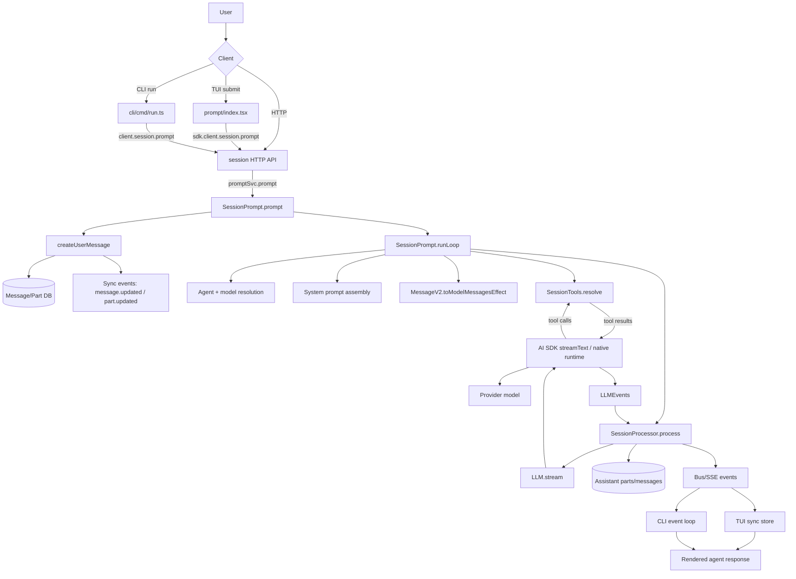
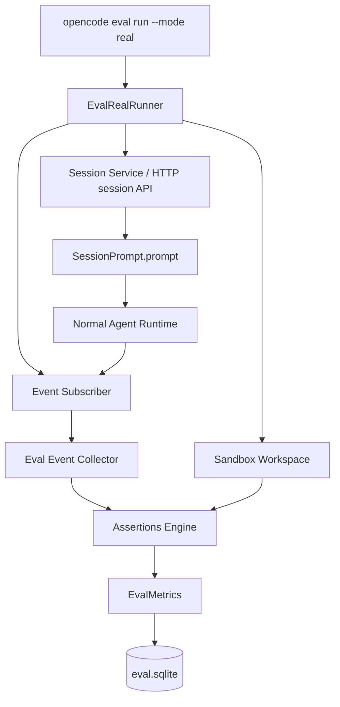

# Architecture actuelle opencode — du prompt utilisateur à la réponse de l'agent

Date d'audit : 2026-06-20  
Repository : `C:\jeanluc\opencode-fork`  
Portée : runtime opencode actuel, prompts, session loop, tools, streaming, événements, TUI/CLI/API, eval harness.

---

## 1. Résumé exécutif

Le flow actuel d'opencode est centré sur une boucle de session située dans `packages/opencode/src/session/prompt.ts`. Les clients (TUI, CLI, API HTTP) soumettent un message utilisateur à `SessionPrompt.prompt`. Ce service :

1. résout l'agent et le modèle ;
2. crée/persiste le message utilisateur et ses parts ;
3. entre dans une boucle d'orchestration ;
4. construit le contexte système + historique + outils ;
5. délègue le stream LLM à `SessionProcessor` ;
6. transforme les événements LLM en parts persistées (`text`, `reasoning`, `tool`, `step-*`, `patch`) ;
7. publie les événements au bus/SSE ;
8. les clients consomment les événements pour afficher la réponse.

Le système runtime est donc déjà riche en observabilité naturelle : messages, parts, deltas, steps, usage tokens/cost, patch snapshots, erreurs, permissions, tool lifecycle. En revanche, le harness `eval` actuel **ne mesure pas encore ce runtime réel** : il exécute des scénarios simulés via `simulateScenario`, génère de faux tool calls à partir des comportements attendus, estime les tokens par longueur de texte et ne lance ni session, ni agent, ni modèle, ni outil réel.

Conclusion : le runtime agent est architecturé pour être observable, mais le harness actuel teste surtout la plomberie de reporting et non la qualité réelle des agents. L'amélioration prioritaire est de créer un runner d'évaluation réel branché sur `SessionPrompt`/API session et sur les événements `message.*`.

### 1.1 Guide utilisateur — comment mieux piloter opencode

Cette section transforme l'analyse backend en règles d'usage. L'objectif business n'est pas seulement de comprendre le code : il est de savoir comment obtenir plus vite une réponse fiable, complète et de qualité.

#### Ce qui arrive réellement à votre prompt

Quand vous envoyez un prompt, opencode ne livre pas uniquement votre texte au modèle. Il fabrique une requête backend composée de :

```txt
SYSTEM FINAL =
  PROMPT_CORE opencode ou prompt custom de l'agent
  + environnement runtime
  + instructions globales/projet
  + liste de skills proposée
  + bloc descriptif available_capabilities selon mode
  + task-contract / goal reminder éventuels
  + user.system éventuel

MESSAGES = historique converti en messages modèle + rappels backend éphémères
TOOLS = vrais outils AI SDK résolus séparément par le registry/MCP/permissions
```

Références backend vérifiées :

- assemblage final du system : `packages/opencode/src/session/llm/request.ts:55-65` ;
- insertion du system dans les messages modèle : `packages/opencode/src/session/llm/request.ts:93-104` ;
- base `PROMPT_CORE` unique : `packages/opencode/src/session/system.ts:20-25`, contenu dans `packages/opencode/src/session/prompt/core.txt:1-136` ;
- construction `env + instructions + skills + toolList + task-contract` : `packages/opencode/src/session/prompt.ts:2088-2115` ;
- résolution des vrais tools : `packages/opencode/src/session/tools.ts:50-229`.

#### Défaut pratique n°1 — `available_capabilities` est incomplet par design

Le bloc :

```xml
<available_capabilities>
  The following tools are available for file and command operations:
  - write_file
  - bash
  - read
  - edit
  - glob
  - grep
</available_capabilities>
```

vient de `SystemPrompt.toolList()` et n'est injecté qu'en mode `interactive-tui`. Voir `packages/opencode/src/session/system.ts:181-199`.

Ce bloc est **descriptif**, pas contractuel. Il ne liste qu'un sous-ensemble lisible des capacités fichier/commande. Les vrais outils disponibles au LLM sont construits ailleurs, par `SessionTools.resolve()` : registry interne, plugins, MCP, permissions, cache, provider, modèle, etc. Voir `packages/opencode/src/session/tools.ts:50-229`.

Conséquence utilisateur : ne déduisez pas les outils réels uniquement depuis `available_capabilities`. Le modèle peut avoir d'autres tools exposés dans la requête `tools`, ou au contraire certains outils listés peuvent être bloqués par permissions/sécurité.

Bon usage :

- pour une tâche fichier/code, demandez explicitement : « inspecte les fichiers pertinents avec grep/read avant de modifier » ;
- pour une tâche risquée, précisez les restrictions : « ne lance pas de commande destructive », « lecture seule », « ne commit pas » ;
- pour un diagnostic outil, demandez au modèle de vérifier le code/registry plutôt que de raisonner depuis `available_capabilities`.

Impact business :

| Critère | Effet | Recommandation |
|---|---|---|
| Efficacité | Le bloc aide le modèle à se souvenir des outils courants mais peut masquer les vrais tools. | Formuler l'action attendue, pas seulement « utilise tes outils ». |
| Performance | Texte court, peu coûteux. | Garder descriptif ; ne pas surcharger avec tous les tools. |
| Qualité | Risque d'erreur si le modèle croit que la liste est exhaustive. | Demander vérification backend en cas de doute. |
| Vitesse | Accélère les cas simples fichier/commande. | Pour cas complexes, préciser le workflow attendu. |

#### Défaut pratique n°2 — les skills sont proposés, pas automatiquement appliqués

Les skills sont injectés dans le system prompt par :

```ts
const skills = yield* sys.skills(agent, lastUserText)
if (skills) system.push(skills)
```

Référence : `packages/opencode/src/session/prompt.ts:2099-2104`.

La sélection côté backend est limitée : `MAX_RELEVANT_SKILLS = 30` dans `packages/opencode/src/session/system.ts:27`, avec ranking par pertinence (`rankDocuments`) et accès au `Skill.Service`. Le résultat est une **liste de skills et de descriptions** : elle indique au modèle quels skills existent et quand les charger, mais elle ne remplace pas l'appel explicite au tool `skill()`.

Conséquence utilisateur : si vous dites seulement « fais le build », le modèle peut ne pas charger le skill `fork-build` s'il n'identifie pas correctement le besoin. Si vous dites « utilise le skill fork-build et suis-le exactement », vous réduisez l'ambiguïté et les essais inutiles.

Bon usage :

- nommez le skill quand vous le connaissez : « utilise `fork-build` », « utilise `docx` », « utilise `formio-gnspd` » ;
- si vous ne connaissez pas le skill, décrivez le domaine : « tâche de déploiement du fork opencode », « création formulaire FormIO GNSPD » ;
- pour les procédures critiques, ajoutez : « suis le skill, ne fais rien d'autre » ;
- pour éviter la surcharge, ne demandez pas de charger tous les skills ; demandez le skill pertinent.

Impact business :

| Critère | Effet | Recommandation |
|---|---|---|
| Efficacité | Les skills apportent procédures et garde-fous métier. | Citer le skill ou le domaine métier dès le prompt. |
| Performance | Lister/ranker des skills coûte du contexte ; charger un skill ajoute encore du contexte. | Charger uniquement le skill utile. |
| Qualité | Un skill chargé au bon moment évite les protocoles inventés. | Pour build/deploy, docs, FormIO, etc., exiger le skill. |
| Vitesse | Bon skill = moins d'itérations ; mauvais/absent = trial-and-error. | Donner le nom exact du skill quand possible. |

#### Défaut pratique n°3 — richesse du system prompt = qualité, mais aussi latence et dilution

Le system prompt opencode est volontairement riche : identité agent, objectif business, DoD, sécurité, instructions projet, skills, environnement. C'est utile pour les tâches complexes, mais cette richesse peut ralentir les tâches simples et diluer la demande si l'objectif utilisateur est vague.

Bon usage :

- donnez un objectif business clair : « optimiser qualité et fiabilité », « aller vite sans modifier le code », « audit lecture seule » ;
- donnez une Definition of Done courte et vérifiable ;
- indiquez le hors-périmètre : « pas de commit », « pas de déploiement », « backend seulement » ;
- pour une question ponctuelle, demandez explicitement une réponse courte sans exploration large.

Exemple de prompt efficace :

```txt
Objectif : diagnostiquer côté backend pourquoi le tool planning n'est pas disponible en session réelle.
DoD : citer fichiers/lignes, dire s'il manque un tool ou seulement une config, ne pas modifier le code.
Hors périmètre : TUI, build, déploiement.
Utilise grep/read ; si un skill s'applique, charge-le d'abord.
```

Pourquoi c'est meilleur :

- efficacité : l'agent sait quel résultat produit de la valeur ;
- performance : il évite recherches et outils hors sujet ;
- qualité : les critères de complétude sont vérifiables ;
- vitesse : moins d'allers-retours de clarification.

---

## 2. Vue d'ensemble des composants

| Couche | Rôle | Fichiers clés |
|---|---|---|
| TUI prompt | Saisie utilisateur, création session, envoi prompt/commande/shell | `src/cli/cmd/tui/component/prompt/index.tsx` |
| CLI run | Mode non-interactif, headless, rendu stdout, permission auto-reject/skip | `src/cli/cmd/run.ts` |
| API session | Endpoints `session.prompt`, `prompt_async`, `command`, `shell` | `src/server/routes/instance/httpapi/groups/session.ts`, `handlers/session.ts` |
| API events | SSE global des événements du bus | `src/server/routes/instance/httpapi/handlers/event.ts` |
| Session prompt | Création message utilisateur, boucle agent, assemblage contexte | `src/session/prompt.ts` |
| Message model | Schémas messages/parts, conversion en AI SDK messages | `src/session/message-v2.ts` |
| Tool resolution | Transformation registry/MCP → tools AI SDK + permissions | `src/session/tools.ts`, `src/tool/registry.ts`, `src/tool/tool.ts` |
| LLM runtime | Préparation requête, provider, AI SDK/native runtime, stream events | `src/session/llm.ts`, `src/session/llm/ai-sdk.ts` |
| Processor | Consommation stream, persistance parts, usage/cost, tool lifecycle | `src/session/processor.ts` |
| Persistence/events | Update message/part, projectors DB, publish bus/global bus | `src/session/session.ts`, `src/sync/index.ts`, `src/session/projectors.ts` |
| TUI sync store | Réception `message.updated`, `message.part.updated/delta` | `src/cli/cmd/tui/context/sync.tsx` |
| Eval harness | Scénarios, simulation, métriques SQLite, CLI eval | `src/eval/*`, `src/cli/cmd/eval.ts` |

---

## 3. Diagramme textuel haut niveau



> Note : GitHub Markdown peut ne pas rendre Mermaid selon le viewer. La séquence ASCII ci-dessous reste exploitable sans outil.

---

## 4. Séquence détaillée utilisateur → agent → réponse

```text
1. User writes prompt
   ├─ TUI: prompt/index.tsx expands editor/file/extmark parts
   ├─ CLI: run.ts prepares text/files/model/agent
   └─ HTTP client: POST /session/:sessionID/message

2. Client submits payload
   ├─ TUI: sdk.client.session.prompt({ sessionID, agent, model, parts })
   ├─ CLI: client.session.prompt(...)
   └─ API: SessionHttpApi.prompt → promptSvc.prompt(...)

3. SessionPrompt.prompt
   ├─ load session
   ├─ cleanup revert state
   ├─ createUserMessage(input)
   │  ├─ resolve agent/default agent
   │  ├─ resolve model/default/variant
   │  ├─ normalize parts: text, file, directory, MCP resources, agent refs
   │  ├─ optionally call read tool for attached files/dirs
   │  ├─ trigger plugin hook chat.message
   │  ├─ persist user MessageV2.User
   │  └─ persist user parts
   ├─ touch session
   ├─ apply per-prompt tool permission overrides
   └─ if noReply != true → loop({ sessionID })

4. SessionPrompt.runLoop
   while true:
     ├─ status = busy
     ├─ load compacted message history
     ├─ compute latest user/assistant/tasks
     ├─ exit if previous assistant already finished and no pending tools
     ├─ handle subtask or compaction task if present
     ├─ auto-compact if context overflow risk
     ├─ resolve agent and model
     ├─ create assistant message shell
     ├─ optionally auto-plan complex build/orchestrator tasks
     ├─ ensure Goal/DoD task contract
     ├─ apply reminders/context rollout
     ├─ resolve tools from registry + MCP
     ├─ build system prompt array
     │  ├─ environment(model)
     │  ├─ instruction.system()
     │  ├─ skills(agent, current task)
     │  ├─ task contract + goal reminder
     │  ├─ adaptive/personality/pending daemon context
     │  └─ methodology reminders
     ├─ convert message history to AI SDK ModelMessage[]
     └─ SessionProcessor.process({ system, messages, tools, model })

5. SessionProcessor.process
   ├─ calls LLM.stream(...)
   ├─ drains normalized LLMEvent stream
   ├─ on text-start: create text part
   ├─ on text-delta: append in memory + publish part delta
   ├─ on text-end: plugin transform + persist final text part
   ├─ on reasoning events: same lifecycle for reasoning part
   ├─ on tool-call: create/update running tool part, ask doom-loop permission if repeated
   ├─ on tool-result: normalize output/attachments, complete tool part
   ├─ on step-finish: update assistant usage/cost/finish, create patch part if files changed
   ├─ on errors: mark assistant error + publish session.error
   └─ cleanup finalizes active parts and assistant message

6. LLM.stream
   ├─ resolve provider language model + auth + config
   ├─ prepare request via LLMRequestPrep
   ├─ choose runtime:
   │  ├─ native runtime if experimental and supported
   │  └─ AI SDK streamText otherwise
   ├─ AI SDK receives tools and messages
   ├─ provider streams text/reasoning/tool events
   └─ adapter converts provider/AI SDK events → opencode LLMEvent

7. Event propagation
   ├─ session.updateMessage/updatePart → SyncEvent projectors → DB
   ├─ updatePartDelta → BusEvent only for incremental text/reasoning
   ├─ Sync process publishes converted events to project bus + GlobalBus
   ├─ HTTP /event streams bus events as SSE
   ├─ TUI sync store updates message/part state
   └─ CLI loop renders completed parts or JSON events
```

---

## 5. Entrées utilisateur et transport

### 5.1 TUI

Fichier : `packages/opencode/src/cli/cmd/tui/component/prompt/index.tsx`

Le TUI prépare une session si nécessaire puis choisit entre trois chemins :

- shell mode → `sdk.client.session.shell(...)` ;
- slash command → `sdk.client.session.command(...)` ;
- prompt normal → `sdk.client.session.prompt(...)`.

Références vérifiées :

- création de session : lignes ~1072-1080 ;
- shell : lignes ~1139-1148 ;
- command : lignes ~1165-1179 ;
- prompt normal : lignes ~1181-1199.

Particularités :

- les extmarks/pasted text sont réinjectés inline avant soumission ;
- le contexte éditeur peut être ajouté comme part synthétique ;
- les file parts sont conservées et normalisées côté session.

### 5.2 CLI `opencode run`

Fichier : `packages/opencode/src/cli/cmd/run.ts`

Le CLI non-interactif souscrit aux événements avant de soumettre le prompt, puis rend les événements pertinents :

- `message.updated` assistant → affiche header agent/model ;
- `message.part.updated` tool/text/reasoning/step → stdout ou JSON ;
- `session.error` → erreur ;
- `session.status idle` → fin de boucle ;
- `permission.asked` → auto-reject sauf `--dangerously-skip-permissions`.

Références : boucle event lines ~665-786 ; soumission prompt lines ~869-876 ; headless lines ~804-844.

### 5.3 API HTTP

Fichiers :

- routes : `src/server/routes/instance/httpapi/groups/session.ts` ;
- handlers : `src/server/routes/instance/httpapi/handlers/session.ts`.

Endpoints clés :

- `POST /session/:sessionID/message` (`session.prompt`) ;
- `POST /session/:sessionID/prompt_async` (`session.prompt_async`) ;
- `POST /session/:sessionID/command` ;
- `POST /session/:sessionID/shell`.

Le handler sync appelle `promptSvc.prompt` et renvoie le message final en JSON stream. Le streaming live n'est pas transporté par la réponse HTTP de `session.prompt`; il passe par `/event` SSE.

---

## 6. Cœur d'orchestration : `SessionPrompt`

Fichier : `packages/opencode/src/session/prompt.ts`

### 6.1 `createUserMessage`

Responsabilités principales :

- résoudre l'agent (`agents.get` ou agent par défaut) ;
- résoudre le modèle courant/défaut/variant ;
- créer `MessageV2.User` ;
- publier les événements v2 optionnels `AgentSwitched` / `ModelSwitched` ;
- résoudre les parts :
  - texte normal ;
  - fichier local (`file:`) ;
  - données inline (`data:`) ;
  - ressource MCP ;
  - part `agent` pour subagent ;
- utiliser le `read` tool pour matérialiser les fichiers texte/répertoires en parts textuelles ;
- déclencher plugin hook `chat.message` ;
- normaliser images ;
- persister message + parts via `sessions.updateMessage` et `sessions.updatePart`.

Références : fonction démarre autour de la ligne 1089 ; persistance lignes ~1516-1517.

### 6.2 `prompt`

`SessionPrompt.prompt` :

1. charge la session ;
2. nettoie l'état revert ;
3. crée le message utilisateur ;
4. applique les permissions de tools passées dans le prompt ;
5. retourne directement si `noReply`; sinon appelle `loop`.

Références : lignes ~1611-1629.

### 6.3 `runLoop`

`runLoop` est le centre de gravité du runtime agent.

Pseudo-code fidèle :

```text
while true:
    set session status busy
    msgs = filterCompactedEffect(sessionID)
    latest = MessageV2.latest(msgs)

    if assistant already finished and no live tool calls:
        break

    if pending subtask:
        handleSubtask(); continue

    if pending compaction:
        compaction.process(); continue/break

    if context overflow:
        compaction.create(); continue

    model = getModel(lastUser.model)
    agent = agents.get(lastUser.agent)
    assistant = create assistant message
    persist assistant

    maybe auto-plan complex task
    goalState = ensureGoalState(...)
    msgs = SessionReminders.apply(...)

    tools = SessionTools.resolve(...)
    system = environment + instructions + skills + task contract + reminders
    modelMsgs = MessageV2.toModelMessagesEffect(msgs, model, rollout options)

    result = SessionProcessor.process({ system, modelMsgs, tools, model })

    if structured output finished: break
    if result == stop: break
    if result == compact: compaction.create(...)
    continue
```

Références : boucle démarre ligne ~1640 ; assistant message ~1739-1754 ; tool resolution ~1838-1852 ; system/model message build ~1890-1978 ; processor call ~1979-1990.

---

## 7. Construction du contexte envoyé au modèle

La charge utile LLM est séparée en deux blocs :

1. `system: string[]` — contexte système et instructions ;
2. `messages: ModelMessage[]` — historique conversationnel converti.

### 7.1 System prompt dynamique

Le tableau `system` contient notamment :

- environnement runtime (`sys.environment(model)`) ;
- instructions chargées (`instruction.system()`) ;
- skills disponibles et filtrés (`sys.skills(agent, lastUserText)`) ;
- task contract Goal/DoD ;
- goal reminder ;
- adaptive prompt/personality ;
- pending daemon tasks/notifications/learnings ;
- plan auto-généré pour tâches complexes ;
- reminders méthodologiques.

Cette partie se situe dans `SessionPrompt.runLoop`, lignes ~1890-1978.

### 7.2 Historique → AI SDK messages

Fichier : `packages/opencode/src/session/message-v2.ts`

`toModelMessagesEffect` convertit les messages persistés en format AI SDK :

- user text/file/compaction/subtask parts ;
- assistant text/reasoning ;
- tool parts en `tool-${name}` avec état `output-available` ou `output-error` ;
- replay contrôlé des inputs/outputs/reasoning selon `SessionContextRollout` ;
- extraction de media en user message synthétique si un provider ne supporte pas les media dans tool results.

Références : définition événements lines ~638-666 ; conversion démarre ligne ~751 ; user conversion ~824-870 ; assistant/tool replay ~873-1048.

---

## 8. Outils et permissions

Fichier : `packages/opencode/src/session/tools.ts`

`SessionTools.resolve` transforme deux familles d'outils en tools AI SDK :

1. outils internes opencode depuis `ToolRegistry` ;
2. outils MCP depuis `MCP.Service`.

Pour chaque tool interne :

- transformation JSON schema provider-compatible ;
- wrapping `tool({ description, inputSchema, execute })` ;
- création d'un `Tool.Context` avec `sessionID`, `messageID`, `callID`, `agent`, `messages`, `metadata`, `ask`; 
- hooks plugin `tool.execute.before` / `tool.execute.after` ;
- exécution `item.execute(args, ctx)` ;
- attachements enrichis avec `PartID`, `sessionID`, `messageID`.

Pour chaque tool MCP :

- transformation schema ;
- demande de permission `ctx.ask({ permission: key, ... })` ;
- exécution MCP ;
- normalisation text/image/resource ;
- truncation via `Truncate` ;
- retour compatible tool result.

Références : contexte outil lines ~42-73 ; internal tools ~75-116 ; MCP tools ~118-203.

### Point de qualité

Le tool system est bien placé pour un harness réel : il connaît `callID`, `messageID`, `sessionID`, permissions, metadata, outputs, attachments. Un eval runner pourrait observer ces parts sans instrumentation majeure.

---

## 9. Runtime LLM

Fichier : `packages/opencode/src/session/llm.ts`

`LLM.stream` est l'interface publique. Elle :

1. crée un `AbortController` scoped ;
2. appelle `run({ ...input, abort })` ;
3. choisit runtime native ou AI SDK ;
4. retourne un `Stream<LLMEvent>`.

Chemin AI SDK par défaut :

- `provider.getLanguage(input.model)` ;
- `config.get()` ;
- `provider.getProvider(...)` ;
- `auth.get(...)` ;
- `LLMRequestPrep.prepare(...)` ;
- `streamText({ tools, toolChoice, messages, model: wrapLanguageModel(...) })` ;
- `LLMAISDK.toLLMEvents` convertit `fullStream` en événements opencode.

Références : type `StreamInput` lines ~33-46 ; préparation ~95-113 ; runtime native fallback ~218-259 ; `streamText` ~272-339 ; conversion fullStream ~356-364.

---

## 10. Streaming, persistence et rendu client

### 10.1 Processor

Fichier : `packages/opencode/src/session/processor.ts`

`SessionProcessor` consomme le flux `LLMEvent` et le projette en parts persistées :

| Événement | Effet |
|---|---|
| `reasoning-start/delta/end` | crée, delta-update puis finalise une reasoning part |
| `text-start/delta/end` | crée, delta-update puis finalise une text part |
| `tool-input-start/end` | crée/assure tool part pending |
| `tool-call` | marque tool running avec input, vérifie doom-loop |
| `tool-result` | complète tool part avec output/attachments |
| `tool-error` | marque tool error |
| `step-start` | crée step-start part + snapshot initial |
| `step-finish` | calcule usage/cost, finish reason, patch diff, assistant update |
| provider error | assistant error + `session.error` |

Références : switch `handleEvent` démarre ~305 ; text lifecycle ~619-683 ; tool lifecycle ~350-521 ; step finish ~555-617 ; process loop ~780-848.

### 10.2 Events et DB

Les messages/parts passent par :

- `sessions.updateMessage` / `sessions.updatePart` ;
- `MessageV2.Event.Updated` / `PartUpdated` ;
- projectors DB ;
- `sync/index.ts` publie sur project bus + GlobalBus ;
- `updatePartDelta` publie `message.part.delta` pour streaming fin.

Références : `message-v2.ts` événements ~638-666 ; `sync/index.ts` publish ~340-371.

### 10.3 SSE

Fichier : `src/server/routes/instance/httpapi/handlers/event.ts`

`/event` souscrit au bus et émet :

- `server.connected` ;
- tous les événements bus ;
- heartbeat toutes les 10s ;
- arrêt sur `Bus.InstanceDisposed`.

Références : subscription/pump lines ~21-52.

### 10.4 TUI store

Fichier : `src/cli/cmd/tui/context/sync.tsx`

Le store TUI applique :

- `message.updated` → insertion/update triée ;
- `message.part.updated` → insertion/update part ;
- `message.part.delta` → append delta au champ texte/reasoning.

Références : lines ~253-342.

---

## 11. Où se brancher pour observer/tester la qualité agent

| Besoin harness | Point de branchement recommandé | Pourquoi |
|---|---|---|
| Prompt envoyé | API `session.prompt` ou direct `SessionPrompt.prompt` | Chemin runtime réel |
| Début/fin de réponse | `session.status busy/idle`, assistant `message.updated` | Délimite scénario |
| Texte final | `message.part.updated` avec `part.type === "text" && time.end` | Réponse stable |
| Streaming | `message.part.delta` | Latence et UX streaming |
| Tool calls réels | `message.part.updated` `type === "tool"` | Noms, inputs, outputs, erreurs |
| Permissions | `permission.asked` + replies | Couverture sécurité/UX |
| Usage tokens/cost | `step-finish` part + assistant message tokens/cost | Coût/perf |
| File changes | `patch` parts + `session.diff` | Validation fonctionnelle |
| Erreurs | `session.error`, assistant `error` | Robustesse |
| Retry | `SessionEvent.Retried` si event v2 activé / session status retry | Résilience provider |
| Context assembly | logs/hooks around `SessionPrompt.runLoop` | Debug prompt quality |

---

## 12. Eval harness actuel

### 12.1 Architecture

Fichiers :

- scénarios : `src/eval/scenario.ts` ;
- service : `src/eval/index.ts` ;
- métriques : `src/eval/metrics.ts` ;
- sandbox : `src/eval/sandbox.ts` ;
- CLI : `src/cli/cmd/eval.ts`.

Le service expose :

- `runScenario` ;
- `runSuite` ;
- `runFullBenchmark` ;
- `listScenarios` ;
- `listReports` ;
- `compareRuns` ;
- `detectRegression` ;
- `getBaseline` ;
- `compareToBaseline`.

Les métriques sont persistées en SQLite : `~/.config/opencode/eval.sqlite`, tables `eval_run` et `eval_scenario_result`.

### 12.2 Scénarios

Un scénario contient :

- `taskPrompt` ;
- `expectedBehaviors` ;
- `requiredKeywords` ;
- `requiredActions` ;
- `antiPatterns` ;
- `validationCommand` ;
- `timeoutSeconds`, `maxTokens`, `setupFiles`.

Exemples intégrés : `hello-world`, `fix-syntax-error`, `refactor-to-arrow`, `write-unit-test`, `code-review-simple`, `design-api-endpoint`, etc.

### 12.3 Limitation critique : simulation

Le service actuel ne lance pas le vrai runtime agent.

Dans `src/eval/index.ts` :

- `runScenario` appelle `simulateScenario` directement ;
- `simulateScenario` génère un output `[Simulated] Running: ...` ;
- les `toolCalls` sont copiés depuis `expectedBehaviors.requiredActions` ;
- les tokens sont estimés par `Math.round(output.length * 1.5)` ;
- `autoEvaluate` fait du keyword/action matching, sauf validation command avec `cwd` ;
- le chemin principal ne fournit pas de `cwd`, donc les validations fonctionnelles sont largement contournées.

Références : `simulateScenario` lines ~223-258 ; `runScenario` lines ~307-313 ; `runSuite` ~315-352.

La CLI confirme ce statut : `opencode eval run` est décrit comme simulation mode et le commentaire final indique qu'un runner real-agent reste à implémenter.

Référence : `src/cli/cmd/eval.ts` lines ~63-80 et commentaire ~292-293.

---

## 13. Évaluation de la qualité actuelle du harness

### Points forts

1. **Structure de scénarios claire** : catégories, difficulté, tags, expected behaviors.
2. **Métriques persistées** : runs, scenarios, trends, compare, regression detection.
3. **CLI exploitable** : list/run/report/watch/compare/trend.
4. **Base pour CI/sanity** : simulation rapide sans provider.
5. **Schema extensible** : champs agent/model/tags/metadata déjà présents en DB.
6. **Le runtime agent est déjà observable** via message/part/events, donc un real runner est faisable sans refonte totale.

### Faiblesses actuelles

| Sévérité | Problème | Impact |
|---|---|---|
| Critique | Pas de vrai agent/model/session | Le pass rate ne reflète pas la capacité agent |
| Critique | Tool calls synthétiques | Impossible de mesurer tool use réel |
| Haute | Tokens synthétiques | Coût/performance non mesurés |
| Haute | Validation commands rarement exécutées | Les scénarios file/code ne prouvent pas les livrables |
| Haute | `--agent` / `--model` informatifs seulement | Impossible de comparer agents/modèles |
| Haute | Single scenario CLI semble appeler `runSuite(scenarioId)` | Risque de bug pour `opencode eval run hello-world` |
| Moyenne | Sandbox utilise probablement `process.chdir` | Risque concurrence/daemon |
| Moyenne | Matching `some` sur keywords/actions | Critères trop permissifs |
| Moyenne | Anti-patterns traités comme substring | Regex-like patterns inefficaces |
| Moyenne | Pas d'API eval | Pas de dashboard ni orchestration externe |

---

## 14. Recommandations priorisées

### P0 — Brancher un real-agent eval runner

Créer un mode explicite :

```text
opencode eval run <target> --mode simulated   # actuel
opencode eval run <target> --mode real --agent build --model provider/model
```

Flow proposé :

```text
FOR each scenario in suite:
    sandbox = create isolated workspace
    write scenario.setupFiles into sandbox
    session = Session.create({ workspace: sandbox, agent, model })
    subscribe to bus/SSE filtered by sessionID
    start timer + timeout
    SessionPrompt.prompt({ sessionID, parts: [{type:'text', text: taskPrompt}], agent, model })
    wait until session.status == idle OR timeout/error
    collect:
        final text parts
        tool parts
        step-finish tokens/cost
        patch/session diff
        permission events
        errors/retries
    run validationCommand(s) with cwd=sandbox
    record ScenarioResult + metadata
```

Pourquoi P0 : c'est le seul moyen de savoir si l'agent répond vraiment bien.

### P0 — Corriger le chemin single-scenario CLI

Aujourd'hui, le chemin scénario appelle `svc.runSuite(args.target, ...)` alors que `args.target` est un scenario id. Il faut appeler `runScenario` ou construire un report mono-scénario.

### P1 — Rendre les critères d'évaluation plus stricts

Remplacer les champs ambigus par :

```ts
assertions: Array<
  | { type: "output_contains_all"; values: string[] }
  | { type: "output_contains_any"; values: string[] }
  | { type: "output_not_matches"; regex: string }
  | { type: "tool_called"; name: string; min?: number; max?: number }
  | { type: "tool_sequence"; names: string[] }
  | { type: "file_exists"; path: string }
  | { type: "file_contains"; path: string; text?: string; regex?: string }
  | { type: "command_succeeds"; command: string }
>
```

### P1 — Stocker les métadonnées réelles

Remplir les colonnes déjà prévues (`agent`, `model`, `metadata`) et ajouter/encoder :

- provider id ;
- opencode version / git commit ;
- session id ;
- workspace/sandbox id ;
- token input/output/reasoning/cache ;
- cost ;
- tool call list ;
- timeout reason ;
- permission denials ;
- retry count ;
- runtime mode (`simulated`/`real`).

### P1 — Événements eval progress

Publier :

```text
eval.run.started
eval.scenario.started
eval.scenario.event
eval.scenario.completed
eval.run.completed
eval.run.failed
```

Cela permet un dashboard et un watch CLI propre.

### P2 — API/HTTP eval

Ajouter endpoints :

- `GET /eval/scenarios` ;
- `POST /eval/runs` ;
- `GET /eval/runs/:id` ;
- `GET /eval/reports` ;
- `GET /eval/compare?base=&current=`.

### P2 — Baselines explicites

Permettre de pinner un run comme baseline :

```text
opencode eval baseline set <runId>
opencode eval baseline compare <runId>
```

### P2 — Sandbox sans global CWD

Éviter `process.chdir`; passer `cwd` explicitement aux commandes, outils et sessions.

---

## 15. Proposition d'architecture cible pour le harness réel



Séparation recommandée :

| Module | Responsabilité |
|---|---|
| `eval/runner-simulated.ts` | conserver mode rapide actuel |
| `eval/runner-real.ts` | orchestration session réelle |
| `eval/collector.ts` | collecte events message/tool/status |
| `eval/assertions.ts` | assertions structurées |
| `eval/sandbox.ts` | workspace isolé sans chdir global |
| `eval/report.ts` | normalisation report/metadata |

---

## 16. Risques et invariants à préserver

1. **Ne pas casser le streaming UX** : continuer à publier `message.part.delta` tôt et `message.part.updated` final.
2. **Ne pas doubler l'exécution tools** : le harness doit observer les parts, pas réexécuter les tools.
3. **Timeout dur par scénario** : annuler la session proprement et marquer assistant/tool parts interrompues.
4. **Isolation workspaces** : chaque scénario doit avoir son workspace/sandbox.
5. **Modes explicites** : ne jamais mélanger pass rate simulé et pass rate réel.
6. **Reproductibilité** : stocker modèle, provider, version opencode, commit, config de permissions.
7. **Sécurité** : permissions tool en eval doivent être contrôlées par profil (`safe`, `allowlist`, `dangerous`).

---

## 17. Checklist de validation d'un futur real harness

- [ ] `opencode eval run sanity --mode simulated` reste rapide et sans provider.
- [ ] `opencode eval run hello-world --mode real --agent build --model ...` crée réellement `hello_eval.py` dans sandbox.
- [ ] Les tool calls enregistrés correspondent aux `message.part.updated` réels.
- [ ] Les tokens/cost viennent des `step-finish` réels.
- [ ] Les validations `file_exists`, `file_contains`, `command_succeeds` s'exécutent dans le sandbox.
- [ ] Les timeouts annulent la session et enregistrent `timeout`.
- [ ] Les rapports distinguent clairement `mode=simulated` et `mode=real`.
- [ ] Le CLI peut comparer deux runs de même mode/agent/model.

---

## 18. Fichiers clés à relire avant modification du harness

| Priorité | Fichier | Pourquoi |
|---|---|---|
| P0 | `src/session/prompt.ts` | Entrée runtime réelle et boucle agent |
| P0 | `src/session/processor.ts` | Source des parts observables |
| P0 | `src/session/message-v2.ts` | Schémas events/parts/messages |
| P0 | `src/session/tools.ts` | Tool lifecycle et permissions |
| P0 | `src/cli/cmd/eval.ts` | CLI à étendre |
| P0 | `src/eval/index.ts` | Service eval actuel |
| P0 | `src/eval/scenario.ts` | Schema scénarios/assertions |
| P0 | `src/eval/metrics.ts` | Persistance reports |
| P1 | `src/server/routes/instance/httpapi/handlers/event.ts` | Streaming events/SSE |
| P1 | `src/cli/cmd/run.ts` | Exemple de collector event client |
| P1 | `src/cli/cmd/tui/context/sync.tsx` | Exemple d'application events en état local |

---

## 19. Conclusion

L'architecture runtime actuelle d'opencode est structurée autour d'une boucle agent robuste et observable : `SessionPrompt.runLoop` assemble contexte + outils + modèle, `LLM.stream` normalise le provider, `SessionProcessor` persiste chaque événement en parts, et le bus/SSE alimente TUI/CLI.

Le principal écart de qualité est côté harness : le framework eval a une bonne enveloppe (scénarios, CLI, SQLite, trends), mais il ne traverse pas encore le runtime agent réel. Pour évaluer réellement la qualité agent, il faut prioriser un `EvalRealRunner` qui crée une session dans un sandbox, soumet le prompt, observe les événements `message.*`, collecte tool/tokens/cost/diffs, exécute des assertions fonctionnelles, puis persiste un report riche.
